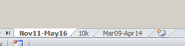

**ИНТЕРПРЕТАЦИИ ПЛТ НАГНЕТАТЕЛЬНЫХ СКВАЖИН.**

Август 2016

Долгушин Т.

Ибатуллина А.

**Введение.**

Данное руководство написано с учетом того, что у пользователя уже есть
навый работы в Техлог и здесь не объясняются подробно очевидные вещи,
как то подключение «папки пользователя» или редактирование выбранное
кривой Flowing.

Для удобной и быстрой интерпретации была создана панель **SPD Bar 2.x**,
в котороую входит меню **ПЛТ**. Панель подключается через «папку
пользователя» Техлог.

Прежде всего необходимо отредактировать скрипты. Проще всего попросить
GE-C, чтоб он настроил все пути и шаблоны в скриптах.

Необходимо настроить следующие пути:

1.  Путь к папке, где будет создаваться папка скважины и где хранятся
    эксель-шаблоны для интерпретации, в сприпте GE-C это
    C:\\Apps\\Routine\\PLT

2.  Понадобится папка, куда будут выгружаться переменные для отправки,
    например C:\\\\Apps\\Routine\\Send_xml\\\\Sended

3.  Понадобится локальная ссылка на сервер, где хранятся уже сделанные
    ПЛТ, например \\\\europe.shell.com\\europe\\E & P\\SPD
    Moscow\\Dept_05\\OFM\\Load_files\\Plt

Для работы понадобятся следующие эксель- и техлог-шаблоны:

1.  123_PLT.xls

2.  LQC_PLT\_.xls

3.  PLT_200.xml

4.  PLT_500.xml

Набор скриптов следующий:

1.  \"Создание папки скважины\" path=\"User\\PLT_preparation\"

2.  \"Загрузка в масштабе 1:200\" path=\"User\\PLT_injection_200\"

3.  \"Загрузка в масштабе 1:500\" path=\"User\\PLT_injection_500\"

4.  \"Генерация диаграммы\" path=\"User\\PLT_injection_plot\"

5.  \"Расчет сплитов\" path=\"User\\PLT_injection_split\"

6.  \"Генерация отчета\" path=\"User\\PLT_injection_report\"

7.  \"Пересчитать сплит при ЗКЦ\" path=\"User\\PLT_crossflow\"

Надо в следующих скриптах указать свою подпись с емейлами, телефонами и
ФИО.

1.  OIS_send_files

2.  OIS_Send_print

**Интепретация ПЛТ нагнетательных скважин.**

1)  Не уверен - сделай дубль скважины! Возможно для простоты
    интепретации придется удалять некоторые датасеты. После работы все
    результаты надо скопировать в основную скважину.

2)  Выбираем нужную скважину в списке и нажимаем кнопку в меню ПЛТ
    **«Создание папки скажины»**. В итоге скрипт создает папку с именем
    скважины в папке C:\\Apps\\Routine\\PLT (можно в скрипте поменять
    папку на любую другую).

3)  Берем полученное письмо с результатами ПЛТ от ТПГ и открываем архив.
    Все файлы из архива закидываем в свежесозданную папку.

4)  Берем лас-файл, у которого в конце 200 (это основной лас-файл с
    данными в масштабе 1:200) и закидываем его в окно техлога. Данные
    оказываются в буфере Техлога. Дальше нажимаем кнопку **«Загрузка в
    масштабе 1:200»**. Во всплывающее окно нужно ввести приемистость
    скважины из пункта 5 отчета ТПГ, который тоже лежит в папке. Если
    данных нет, необходимо указать -9999. Точно так же закидываем в
    Техлог лас-файл с данными в масштабе 1:500 и нажимаем на **«Загрузка
    в маштабе 1:500».**

5)  Нажимаем на кнопку **«Генерация диаграм»** и ждем пока скрипт
    отрисует диаграммы по всем ПЛТ-работам, которые есть в скважине.
    Откроется два окна -- в одном кривые в масштабе 1:200, в другом
    1:500.

6)  Теперь диаграмму кривых 1:200 приводим в порядок. Оставляем только
    последние по времени 3 ПЛТ-иследования.

По необходимости меняем масштаб кривых так, чтоб четко была видна зона
охлаждения и зоны температур, близких к геотермическому градиенту.

Делаем заливку светло-голубым цветом между референсным ГК и ГК из
последней ПЛТ, сажаем эти две кривые максимально друг на друга, меняя
масштаб.

Смотрим чтобы были данные CBL, если нет, то можно удалить колонку.\
Кривые должны быть покрашены в светло-голубой, синий и серый
соответственно. Названия кривых WTEP_S(N), где N может начинаться с 1
или 2.

Выбираем переменную ZONES на 1м треке и меняем шрифт на Ариал 11, затем
делаем расположение названий зон вертикальны -- для этого делаем
выравнивание справа, потом в Properties -\> Display option -\> Vertical
display выставляем yes, а vertical alignment -\> bottom.

7)  **Самое важное!** Когда все температурные кривые правильно
    отображены на диаграмме, проводим анализ распределения температуры
    напротив интервалов перфорации. Общий принцип таков -- наиболее
    поглощающий по спинеру интервал должен сильнее всего охлаждаться
    т.е. температурные кривые показывают минимальные значения и
    расположены очень близко друг к другу, практически сливаются в одну
    линию. Так же хорошо должен поглощать перфорированный интервал с
    хорошей абсолютной или фазовой проницаемостью по воде.

Часто бывает так, что температурную аномалию, какая бывает напротив
принимающего перфорированного интервала, можно наблюдать там, где
перфорации нет, но есть коллектор по интерпретации ГИС. В таком случаее
имеет место заколонный переток нагнетаемой воды, чаще всего он
наблюдается в пласт АС10, но в общем случаее может быть как выше, так и
ниже перфорированных интервалов.

8)  Чтоб рассчитать теоретический процент заколонного
    перетока, надо в Техлоге выбрать инструмент «Interactive selection»
    и выделить интервал от верха или низа перфорации до крайней точки
    принимающего интервала. Затем выделить кривую Flowing и через меню
    Edit/Edit the selected values... присвоить выделенному интервалу
    индекс 2 и поставить галочку в чекбоксе «Assing when missing value».
    Если надо удалить переток, то порядок действий тот же, только
    никакой цифры ставить не нужно.

9)  Дальше необходимо посчитать новый датасет со сплитом после ПЛТ.
    Нажимаем кнопку «Расчет сплитов». В окне выбираем последнюю
    загруженную ПЛТ.

Убеждаемся, что в датасете PLT_МесяцГод появилась переменная %water.
Кидаем ее на трек, где лежит красная кривая спинера и смотрим, чтобы
кривая %water был синего цвета и пунктирный.

10) Обратите внимание чтобы исследовангия разных лет отличались друг от
    друга. Если они совпадают, значит при загрузке произошла ошибка.
    Тогда удалаяем датасеты с загруженными исследованиями (
    PLT_MonthYear, PLT500_MontYear, PLT). И загружаем ласы по новой. См
    пункт 4.

11) Выделяем датасет с добавленным ПЛТ и нажимаем на кнопку «Генерация
    отчета». Скрипт откроет txt-файл в Блокноте с расчитанными сплитами.
    (Пригодится позже, см. Пункт 15)

12) Выделяем скважину и нажимаем на кнопку «Печать диаграмм». В
    появившемся окне печати ставим чекбокс «Adjust to document».
    Сохраняем диаграмму в папку скважины. Также в ходе выполнения скипта
    в папку распечатается файл 10к -- диаграмма в масштабе 1:500.

13) Скрипт скопирует в папку эксель-шаблон для отчетов PLT и LQC, и
    открывает в Экселе диаграмму с результатами последних исследований,
    если такое есть. Предыдущий эксель-отчет копируется в папку
    скважины.

14) В файл 123_PLT вставляем в лист с названием соответсвенно количеству
    иследований картинку с полученной диаграммой (т.е. если 3
    исследования, то в лист 3 и т.д). А в лист 10k -- диаграмму в
    масштабе 1:500.

15) Если до этого было много исследований, лучше скоприровать лист с
    предыдущими исследованиями и назвать соответсвенно месяц-год
    проведенных иследований. Также лист с текущими результатами называем
    подобным образом.\
    

16) Дальше вставляем из предыдущых результатов ПЛТ и отчета,
    сгенерированного в пункте 12 данные в таблицу. Не забываем поменять
    месяц в шапке.

17) Копируем данные из отчетв следующем порядке spinner-\> injection,
    kh-\>Zone cooling\
    

18) Когда все данные внесены, сохраняем файл, переименовываем (например
    WS-1376.xls) и отправляем на проверку GE-C.

19) Еще нужно заполнить LQC. А именно, имя-фамилия интерпретатора, дата
    исследования, дата интерпретации, и имя скважины.

20) Теперь нужно разослать сообщения и данные по результатам выполненной
    работы.\
    Проверенный и исправленный эксель-файл с ПЛТ копируем **в
    \\\\europe.shell.com\\europe\\E & P\\SPD
    Moscow\\Dept_05\\OFM\\Load_files\\Plt** . Потом выделяем скважину и
    нажимаем на кнопку **«Отправка отчетов»**. Появятся шаблоны писем, в
    одно нужно вставить LQC и разослать, во второе письмо ничего
    вставлять не нужно. Письма разослать по списку рассылки. Важно, чтоб
    в письмах была подпись того, кто отправляет, а не дефолтная из
    скрипта.

21) Как всё закончили и внесли все исправления, после проверки нужно
    выслать изменненые датасеты скважины. А именно выделить датасеты
    Common_05, PLT_XXXXX, PLT500_XXXXX и Report_split_N и нажать кнопку
    **«Отправка файлов»**. (По сплитам нужен последний по номеру)

22) По статусу исследований можно смотреть файл
    **\\\\Europe.shell.com\\Europe\\E & P\\SPD Salym Central Processing
    Facility\\Dept_02\\TM24-SSFT\\SSFT\\SSFT
    GE\\GE-C\\Job_database.xlsx**\
    Там информация по работе GE-C. Нужно отфильтровать PLT.
