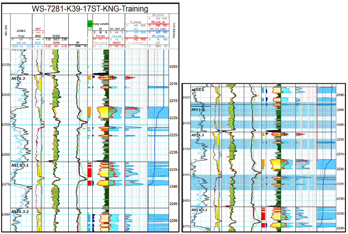

**Руководство по интепретации ГИС.**

Август-Сентябрь 2016

Долгушин Т.

**Введение.**

Предполагается, что определенный навык работы в Техлог у пользователя уже есть и многие простые эелменты интерфейса подробно не объясняются.

Данное руководство нацелено на использование минимального набора скриптов и готовых шаблонов, что соответствено увеличивает объем ручного труда, но упрощает настройку проекта и папки пользователя. Скрипты и шаблоны находятся в т.н. User Folder – данная опция позволяет работать с привычными скриптами и шаблонами в любом из рабочих проектов.

**Загрузка инклинометрии и создание скважины.**

Для создания скважины необходимо загрузить инклинометрию. Для этого удобней всего брать эксель-файл с данными инклинометрии, который мы получаем от Бейкер Хьюз. Для удобства загрузки в Техлог необходимо преобразовать эксель-файл в формат .csv, оставив из всего набора данных только MD, Inclination и Azimuth. Пример преобразования на картинке ниже.

Файл с инклинометрией в фотмате .csv (Comma delimited) необходимо назвать по полному имени скважины с добавлением через «-» код подрядчика по ГИС: KNG или PEX, например WS-7281-K39-17ST-KNG-Field.csv.

Далее берем файл и перетаскиваем на серое поле Техлога, функция drag&drop в Техлоге обычно работает. Система автоматически опознает знакомый формат файла и запустится Data import wizard. В визарде надо будет указать Dataset name: deviation, Dataset type: trajectory, проверить, что визард правильно определил Reference и опознал единицы измерений колонок. После проверки,если все ок, надо нажать Load to the import buffer.

Из буфера появившуюся скважины с датасетом «deviation» нужно загрузить в проект, просто нажав зеленую стрелку. В проекте появится новая скважина с единственным датасетом, окно буфера можно закрыть нажанием на черную кпопку «выключить», оно больше не понадобится.

Далее находим в меню Data -> Reference and coordinates -> TVD Computation…,кликаем на иконку и  проверяем, что семейства указаны правильно. В появившееся окно, в его левую зону Datasets, кидаем датасет deviation. Далее необходимо в ячейке Elevation указать DFE для данного куста, и программа рассчитает опорный для скважины датасет Index.

Важно учитывать, что для переменных в датасете deviation должны быть правильно определены семейства. Проверить это можно, выделив нужную переменную, на вкладке Properties. Переменной азимута соответствует семейство Angel/Hole Azimuth, а переменной зенитного угла - Angle/Hole Deviation. 

Последний шаг для подготовки скважины к расчету интерпретации ГИС - это копирование и актуализация датасета ZONATION, в котором хранятся отбивки по пластам. Взять ZONATION можно в соседней скважине, просто скопиров оттуда датасет в рабочую скважины. Затем необходимо взять отбивки по стволу из суточного рапорта по геологии для каждого пласта и указать их в колонке DEPTH. Для редактирования табличных данны надо выбрать Data / Data editor и в открывшееся окно кинуть датасет ZONATION. Таким образом будут обновлены глубины по MD, для пересчета TVDSS необходимо в датасете Index выбрать переменную TVDSS и скопировать ее в ZONATION. При копировании в окне Resampling tool надо указать Resampling mode «linear anti-aliasing».

**Расчет интепретации ГИС.**

Для загрузки лас-файла надо кинуть его, как и инклиномерию, на серое поле Техлог, и в открывшемся окне буфера загрузки  через Copy&Paste указать имя скважины, в которую надо скопировать лас. Датасет в буфере также надо переименовать в MAIN. Если после переименования новое название не появилось, можно все равно нажать на зеленую стрелку копирования и датасет появится в проекте в нужной скважине с названием MAIN.

Теперь нужно запустить скрипт PPEVAL\_MAIN\_DI\_LITH. Появятся несколько новых датасетов: COMMON\_05, CONTACTS, Rock\_Properties\_Table, ZONATION\_PARAMETERS. Теперь можно запускать шаблон Picking\_tops для корреляции скважин по пробуренным соседкам. Найти какие скважины соседние к текущей можно по последнему проползалу, в котором отрисована карта куста, и лучше это сделать заранее, перед интерпретацией.

В итоге получится диаграмма, где референсные скважины распо-лагаются по сторонам от интер-претируемой. Скважины необходимо выровнять по TVDSS и отключить Shift, если он будет включен.

Иногда бывает так, что переменная ZONES в датасете ZONATION стирается при сохранении, поэтому на такой случай перед редактирование зон лучше ее продублировать. 

Прицип корреляции сам по себе прост, но нужна определенная практика, чтобы «набить глаз». Сначала ориентируемся на GR и находим наибоее «яркие» пласты, обычно это чистый, как правило водонасыщенный, песчаник в АС10 и монолитные глины в Продельте. Далее, по взаимному расположению TNPH vs RHOZ можно легко найти мощную глинистую пачку над АС10, затеме по всем трем кривым, подключая иногда данные RT, коррелируем остальные пласты, стараясь выдерживать примерно одинаковую мощность, особенно если референсные скважины расположены близко от рабочей.

Чтобы включить границы пластов, надо на вкладке Zonation в меню сверху выбрать название датасета, из которого будут подгружены отбивки. Во всех стандантрых скважинах он называется ZONATION. Далее инструментом  двигаем границы на диаграмме. Чтобы сохранить подвижки, на вкладке Zonation надо кликнуть правой кнопкой мыши и выбрать Save the zonation. Звездочка вверху, на названии ZONATION,  должна исчезнуть.

Теперь начинается самое важное – редактирование продуктивных интервалов и их насыщения. Для полноценного отображения всех рассчетных параметров по скважине – результат работы главного скрипта – необходимо применить шаблон KNG или PEX, смотря кто писал каротаж. Получится следующего вида диаграмма, как на рисунке справа.

Для удаление «мусорных» пропластков – обычно это тонкие полоски менее 0.5м на треке насыщения – необходимо из датасета COMMON\_05 кинуть на трек переменную cut. Далее, инструментом выделить участки с удаляемыми пропластками, и выбрав в шапке диаграммы переменную cut, через меню Edit -> Edit the selected values… присвоить выделенным участкам 1. Надо поставить чек в чекбокс Assing when missing value, чтобы cut было присвоено значение «1». После этого надо заново прогнать скрипт PPEVAL\_MAIN\_DI\_LITH и выделенные пропластки исчезнут.

` `

После зачистки пропластков надо проверить адекватность насыщения. Здесь правило следующее: если значение RT в продуктивном интервале <7 ohm\*m - это вода, значения от 7 до 8 ohm\*m это скорей всего нефть + вода или неясно, если RT > 8 ohm\*m – ставим нефть. Редактирование насыщения осуществляется через переменную Fluid\_Index, которая в шапке диаграммы закрашена белым цветом, но если кликнуть под кривой cut, можно выделить переменную Fluid\_Index. 

Индексы для Fluid\_Index следующие: 1 – нефть (красная), 2 – нефть+вода (оранжевая), 3 – вода (синяя), 4 – неясное насыщение (серое), 5 – промытая зона (темно-синее). Насыщение «неясно» ставится, если интерпретатор не уверен какое именно насыщение по сопротивлению. Так бывает, если например по абсолютным отметкам должна быть нефть, а сопротивления показывает воду, и наоборот. Так же «неясно» можно поставить, если по соседним скважинам нет четкого подтверждения нефти на данной глубине, а RT резко менятся от «водяного» до «нефтяного» значения. 

Присвоение числовых значений Fluid\_Index осуществляется так же, как и переменной cut: через меню Edit -> Edit the selected values…, однако чек Assing when missing value ставить НЕ НАДО.

После окончания редактирования насыщения, необходимо удалить датасет CONTACTS и запустить скрипт заново. Теперь надо изменением глубины переменной FWL\_bf в датасете CONTACTS настроить так, чтобы нефтенасыщенность по Ваксман-Смиту (SWWS) примерно совпадала с нефтенасыщением, рассчитанным по капилярным кривым (SW\_SHF). Глубины необходимо изменять в логически обоснованных пределах и при этом внимательно анализировать ситуацию, не является ли разбежка этих кривых признаком промытой зоны. 

Два основных признака промытой зоны это: 

1\. Скважина бурилась по уплотняющей сетке. 

2\. Поблизости есть крупные нагнетательные скважины.

`	`Для генерации отчета необходимо запустить скрипт PPEVAL\_REPORTING\_NEW. Из области Output скрипта надо скопировать полученную информацию в Эксель и применить разделение Text to Columns по запятой (Comma). В итоге получится таблица с данными, состоящая из 3х областей: NET\_sand, NON\_SWEPT\_NET\_pay и TOTAL\_NET\_pay. Для каждой из перечисленных областей приводятся границы пластов от АС10 или АС9 до Продельты по MD и TVDSS, мощность коллекторов (область NET\_sand),  нефтенасыщенная мощность (области NON\_SWEPT\_NET\_pay и TOTAL\_NET\_pay), а так же усреденные по пласту значения пористости (PHI), нефтенасыщенности по Ваксман-Смину и капилярометрии (So\_WS, So\_shf), проницаемости приведены в таблице абсолютная, по нефти и по воде (Kbr,Ko,Kw), так же указана минимальная глубина нефтяного пласта по TVDSS.

**Создание финального отчета оперативной интерпретации.**

Финальный отчет заполнятся по готовому шаблону для каждого месторождения, который можно попросить у ГЕ-Ц, или в крайнем случае нарисовать самостоятельно в Эксель. 

Основная часть отчета, помимо границ пластов в данной скважине по TVDSS, состоит из прогнозных и фактических значений нефтенасыщенной мощности (NET PAY), средней пористости (AVG PHI), средней нефтенасыщенности (AVG Sh), эквивалентная нефтеколонна (EHC) и накопленная проницаемость (Kh). Прогнозные значения берутся из проползала или запрашиваются у московских геологов, а фактические формируются на основании расчетной таблицы. Значения нефтемощности, пористости и нефтенасыщенности по Ваксман-Смиту берутся напрямую из отчетной таблицы скрипта PPEVAL\_REPORTING\_NEW из области NON\_SWEPT\_NET\_pay, значения в которой в случае непромытой скважины равны значениям в области TOTAL\_NET\_pay. Эквивалентная нефтеколонная рассчитывается как произведение мощности, пористости и насыщенности, а накопленная проницаемость для каждого пласта считается как произведение нефтемощности на абсолютную проницаемость данного пласта.

Отчетная диаграмма печатается в формате .png (объем в 3 раза меньше, чем .jpg, при лучшем качестве) на листе А4 с выбранными опциями adjust to the page по высоте и ширине и с отключенными полями without margins. Затем распечатанная диаграмма вставлятеся в эксель-файл и распечатывается в .pdf.

Так же, помимо основной диаграммы, надо распечатать в .pdf диаграмму корреляций. По сути это тот же набор скважин, что был использован при корреляции пластов в самом начале, только скважины добавляются на шаблон финальной диаграммы и распечатываются с чеком в чекбоксе Adjust to document.
